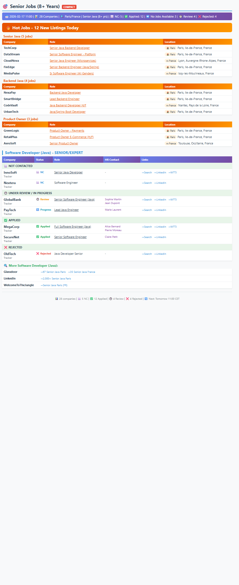
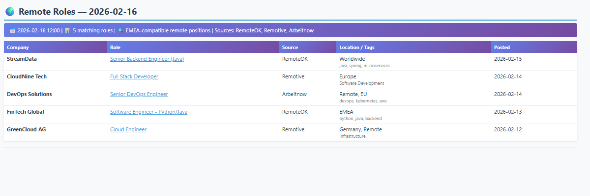

# Claude Job Search Agent 🎯

An end-to-end automated job search pipeline that handles everything from finding opportunities to preparing applications. Sends daily styled HTML email digests from your Excel tracker, scans remote job APIs for EMEA-compatible roles, tailors resumes per company using Gemini AI, and drafts LinkedIn outreach messages — all on autopilot via Windows Task Scheduler.

## Features

- **Daily Email Reports** - Styled HTML emails at 11:00 AM CET with companies grouped by role and status
- **Hot Jobs Section** - Sticky top-5-per-category LinkedIn listings (fully configurable role categories) that persist until you add a company to your tracker, then backfill just that slot
- **Remote Job Scanner** - Fetches from RemoteOK, Remotive, and Arbeitnow APIs every 2 days, filters for EMEA-compatible roles
- **Resume Tailor** - Per-company tailored resumes using Gemini 2.5 Flash (free tier) — never fabricates, only reorders and surfaces existing skills
- **Outreach Drafter** - Auto-generates short/medium/long LinkedIn message templates for each applied company
- **Excel Integration** - Reads your application tracker daily for statuses, role links, and HR contacts
- **HR Contact Management** - Maintains recruiter contacts with clickable LinkedIn hyperlinks
- **Platform Aggregators** - Curated search links (Glassdoor, LinkedIn, WelcomeToTheJungle, etc.)
- **Windows Automation** - Runs on autopilot via Task Scheduler

## Email Previews

All data shown below is fictional.

### Daily Job Report (11:00 AM)


Companies grouped by status with clickable role links, HR contacts (purple), and quick search links. Platform aggregator links appear under each role category.

### Remote Job Scanner (every 2 days, 12:00 PM)


EMEA-compatible remote roles from RemoteOK, Remotive, and Arbeitnow APIs, filtered by your configured role keywords and location preferences.

## What You Get

### Roles Tracked

Roles are defined in `daily_job_search.py` — edit them to match your job search. The default setup includes Java backend and product management roles, but any stack or function works. Each role maps to a set of job board search links and hot jobs queries.

### Status Tracking
- ⬜ Not Contacted
- 🕐 Under Review / In Progress
- ✅ Applied
- ⏸️ No Jobs Available
- ❌ Rejected

## 🌍 Important: Customize for Your Location

This tool comes with sample job search links. **Before using:**
1. Open `daily_job_search.py`
2. Update the location variables at the top (lines 15-16):
   ```python
   LOCATION_CITY = "YourCity"      # Change from "Paris"
   LOCATION_COUNTRY = "YourCountry" # Change from "France"
   ```
3. Optionally update the job board URLs to match your location (see [Customize URLs](#customize-for-your-location) below)

## Prerequisites

- **Python 3.7+**
- **Gmail account** with App Password enabled
- **Excel tracker** (optional but recommended)
- **Windows OS** (for Task Scheduler automation)

## Quick Start

### 1. Install Python Dependencies

```bash
pip install openpyxl requests beautifulsoup4 python-docx
```

### 2. Configure Your Settings

**IMPORTANT:** Create your configuration file:

1. Copy `config.template.py` to `config.py`
2. Edit `config.py` with your details:

```python
EMAIL_CONFIG = {
    'smtp_server': 'smtp.gmail.com',
    'smtp_port': 587,
    'sender_email': 'YOUR_EMAIL@gmail.com',        # ← Your Gmail
    'sender_password': 'YOUR_APP_PASSWORD',         # ← Gmail App Password (16 chars)
    'recipient_email': 'YOUR_EMAIL@gmail.com',      # ← Recipient email
}

TRACKER_FILE = r'C:\Path\To\Your\Tracker.xlsx'     # ← Your Excel tracker path
```

### 3. Get Gmail App Password

1. Go to [Google Account Security](https://myaccount.google.com/security)
2. Enable **2-Step Verification** (if not already enabled)
3. Go to **App passwords** (at the bottom)
4. Select "Mail" and your device
5. Copy the **16-character password** (no spaces)
6. Paste it in `config.py` as `sender_password`

### 4. Test Run

```bash
python daily_job_search.py
```

Check your email - you should receive the job search report!

### 5. Schedule Daily Emails (11:00 AM)

**Easy Setup (Recommended):**

1. Right-click `setup_task_admin.bat`
2. Select **"Run as administrator"**
3. Click "Yes" when prompted
4. You should see "SUCCESS! Scheduled task created"

**Alternative Methods:**
- Run `setup_scheduled_task.ps1` (PowerShell version)
- Manual setup via Task Scheduler GUI (see `SETUP_INSTRUCTIONS.txt`)

## Excel Tracker Setup

### Option 1: Use the Template (Recommended)

1. **Copy the template:**
   ```bash
   # The repository includes tracker_template.xlsx
   # Copy it and customize with your companies
   ```

2. **Update `config.py` with your tracker path:**
   ```python
   TRACKER_FILE = r'C:\Path\To\Your\tracker.xlsx'
   ```

### Option 2: Use Your Existing Tracker

Format your Excel file like this:

| Company | Role | Role link | status of application | potentialHR contact | Other comments |
|---------|------|-----------|----------------------|---------------------|----------------|
| abc | Backend general specialist | https://... | In progress | Jane Smith | |
| xyz | Engineering Manager Java | https://... | Rejected | | |
| hogwarts | Senior Software Engineer | https://... | done | John Doe | |

**Required Columns:**
- **Column A**: Company name (required)
- **Column B**: Role title (can be empty, script will use "Various")
- **Column C**: Application/job posting link (clickable in email report)
- **Column D**: Status - use one of these:
  - `"done"` or `"applied"` → Shows as ✅ Applied
  - `"In progress"` or `"Under Review"` → Shows as 🕐 Review
  - `"Rejected"` → Shows as ❌ Rejected (apply strikethrough formatting)
  - `"Not available"` or `"Nothing to apply"` → Shows as ⏸️ No Jobs Available
  - Empty or anything else → Shows as ⬜ Not Contacted

**Optional Columns:**
- **Column E**: potentialHR contact - recruiter/TA names with LinkedIn hyperlinks (see HR Contacts below)
- **Column F**: Other comments

**Tips:**
- You can add section headers (e.g., "Product Owner Roles") in Column A
- Use strikethrough formatting on rejected companies (the script will detect it)
- The script automatically categorizes roles based on keywords in Column B
- Close Excel file before running the script to avoid permission errors

## HR Contact Lookup

The system supports a **potentialHR contact** column (Column E) in your Excel tracker, showing recruiter/talent acquisition contacts for each company with clickable LinkedIn links in the email report.

### How to Populate HR Contacts

**Option A: Bulk populate with script (recommended for first setup)**

1. Copy `update_hr_contacts.template.py` to `update_hr_contacts.py`
2. Research recruiters for your target companies (search LinkedIn for `"CompanyName" "talent acquisition" OR "recruiter" YourCity site:linkedin.com/in`)
3. Fill in the `HR_CONTACTS` dictionary with `(name, linkedin_url)` tuples
4. Run: `python update_hr_contacts.py`

This adds a **potentialHR contact** column to your Excel with clickable names.

> **Important:** Web-scraped contacts are **suggestions only** — they may be outdated, in the wrong location, or no longer at the company. Always verify on LinkedIn before reaching out.

**Option B: Add contacts directly in Excel**

Simply type recruiter names into Column E of your Excel tracker. To make them clickable:
- Select the cell, right-click → **Link** → paste the LinkedIn profile URL
- The name will appear as a clickable link in the email report

### Append-Only Workflow

The `update_hr_contacts.py` script uses **append-only** logic — it reads existing cell content first and only adds contacts that aren't already there. This means you can freely mix manual Excel edits with script updates:

| Action | What to do |
|--------|------------|
| **Add a contact in Excel** | Just type it in Column E — the script will never overwrite it |
| **Add a new company row** | Just add it in Excel — the script leaves unknown companies alone |
| **Script finds new contacts** | New contacts are added to the `HR_CONTACTS` dict, then the script appends only the new ones |
| **Remove a contact** | Delete from Excel **and** remove from the `HR_CONTACTS` dict in `update_hr_contacts.py` |

The script is **idempotent** — running it multiple times won't create duplicates. Only truly new contacts get appended.

> **Note:** Removal is the only case where you need to update both places (Excel + script). For everything else, your manual Excel edits are always preserved.

### Auto-Update in Daily Email

The daily email script reads the potentialHR contact column **fresh from your Excel every time it runs**. This means:
- Any contacts you add or edit in Column E are automatically included in the next email
- Deleted contacts are removed from the next email
- New company rows with HR contacts are picked up automatically

> **Note:** `update_hr_contacts.py` is gitignored because it contains real contact data.

## Outreach Drafter

After sending the daily email, the system automatically generates LinkedIn outreach drafts for all applied companies (status = "done") that have HR contacts.

**Features:**
- **Short messages** (max 300 chars) per HR contact — for LinkedIn connection requests
- **Long messages** per company — for InMail or email
- **Skip logic** — won't regenerate drafts if roles haven't changed
- **Stable filenames** — one file per company, overwritten only when roles change
- All personal info comes from `USER_PROFILE` in `config.py` (no hardcoded data in code)

**Output:** Drafts are saved to the output folder configured in `outreach_drafter.py`.

**Standalone run:**
```bash
python outreach_drafter.py
```

## Hot Jobs

The daily email includes a **Hot Jobs** section that surfaces fresh LinkedIn listings you haven't seen or applied to yet. It shows 5 jobs per role category (fully configurable), sorted by location priority (City > Country > Region).

**How it works:**
- Fetches from LinkedIn's guest API (search card data: company, title, location, URL)
- Maintains a **sticky list** — the same 5 jobs persist across runs until you act on them
- When you add a company to your Excel tracker, that job drops out and gets backfilled with a fresh one
- Only fetches from LinkedIn when there are empty slots to fill (fast repeat runs)
- Shown as an orange-themed section at the top of the daily email

**Standalone check (no email sent):**
```bash
python daily_job_search.py --hot-jobs
```

**Remove a bad listing** (e.g. closed, wrong language) and blocklist it:
```bash
python daily_job_search.py --hot-jobs --remove "Company" "Role title"
```
Only that specific company+role pair is blocklisted. Other roles from the same company can still appear.

**Refresh all categories** (clear and re-fetch):
```bash
python daily_job_search.py --hot-jobs --refresh
```

**Refresh one category:**
```bash
python daily_job_search.py --hot-jobs --refresh "Senior Java"
```

**Customize queries** in `config.py` (optional — defaults are used if omitted):
```python
HOT_JOB_QUERIES = {
    'Senior Backend': [
        ('senior+backend+developer', 'YourCity, YourCountry'),
        ('senior+software+engineer', 'YourCountry'),
    ],
    'Product Manager': [
        ('product+manager', 'YourCity, YourCountry'),
    ],
}
```

**Per-category title filter** (`HOT_JOB_TITLE_FILTERS` in `daily_job_search.py`): Optionally restrict a category to only show titles containing specific keywords. Useful for broad searches (e.g. "project manager") where you only want IT/tech results:
```python
HOT_JOB_TITLE_FILTERS = {
    'Project Manager': ['java', 'it', 'software', 'data', 'digital', 'cloud'],
}
```

**Note:** The LinkedIn guest API only returns card-level data (title, company, location, URL) — it does not read full job descriptions. Some irrelevant listings may appear; use `--remove` to blocklist them.

## Resume Tailor

Automatically generates per-company tailored resumes using **Gemini 2.5 Flash** (free tier, $0 cost). Runs at the end of the daily pipeline, after outreach drafts.

**What it does:**
- Reads applied companies (status = "done") with non-LinkedIn role links from the Excel tracker
- Fetches job descriptions from those URLs (supports Workday, WelcomeToTheJungle, Salesforce, and other ATS sites via JSON-LD extraction)
- Sends the resume + JD to Gemini to get minimal tailoring suggestions
- Applies changes to a copy of your base DOCX resume and saves per-company files
- Prints a bullet-point **diff summary** showing exactly what changed vs the original

**Rules (hard-coded):**
- NEVER fabricates experience — only reorders skills and adds keywords from existing experience
- Keeps the original job title heading unchanged
- Removes the "Open Minded" line, keeps "Open to remote/hybrid"
- Maximum 3 bullet tweaks per resume to keep changes minimal

**Setup:**
1. Get a free Gemini API key at https://aistudio.google.com/apikey
2. Add to `config.py`:
   ```python
   GOOGLE_API_KEY = 'your_gemini_api_key'
   BASE_RESUME_PATH = r'C:\Path\To\Your\base_resume.docx'
   RESUME_OUTPUT_DIR = r'C:\Path\To\Your\resume_adjusted'
   ```
3. Install dependency: `pip install google-generativeai` (optional, only needed for the SDK — the script uses the REST API directly)

**Batch run (from tracker):**
```bash
python resume_tailor.py
```

**Single job (pass URL + company name):**
```bash
python resume_tailor.py "https://company.workdayjobs.com/job/..." "Company Name"
```

**Idempotent:** Existing resume files are skipped. Delete a file to regenerate it.

**Output:**
- Tailored DOCX: `resume_{company_name}.docx`
- Change summary: `summary_changes_resume_{company_name}.md` — documents all changes applied (tagline, skills reorder, bullet tweaks, summary) plus raw Gemini suggestions

**Auto-outreach:** When running in single mode, outreach drafts are automatically generated after a successful resume tailor (no need to run `outreach_drafter.py` separately).

## Architecture

```
Excel Tracker (List.xlsx)
    │
    ├── daily_job_search.py ──→ HTML email (11:00 AM daily)
    │       │
    │       ├── Hot Jobs ──→ LinkedIn guest API (sticky top-5 per category)
    │       ├── outreach_drafter.py ──→ LinkedIn message drafts
    │       └── resume_tailor.py ──→ Tailored DOCX resumes
    │               │
    │               └── Gemini 2.5 Flash API (free tier)
    │
    └── remote_search/
            └── remote_job_search.py ──→ HTML email (every 2 days at 12:00 PM)
                    │
                    ├── RemoteOK + Remotive + Arbeitnow + WWR + Jobicy APIs
                    ├── LinkedIn France (remote f_WT=2 filter)
                    └── LinkedIn Global (India/Boston/NY + EMEA description verification)
```

## File Structure

```
claude-job-agent/
├── daily_job_search.py                # Main daily pipeline (hot jobs + email + outreach + resume)
├── daily_hot_jobs.json                # Sticky hot jobs state (auto-generated, gitignored)
├── outreach_drafter.py                # LinkedIn outreach draft generator
├── resume_tailor.py                   # Per-company resume tailoring via Gemini AI
├── remote_search/
│   ├── remote_job_search.py           # Remote job API scanner (EMEA filter)
│   └── run_remote_job_search.bat      # Scheduler wrapper for remote search
├── config.template.py                 # Configuration template (copy to config.py)
├── config.py                          # Your private configuration (gitignored)
├── update_hr_contacts.template.py     # HR contacts updater template
├── update_hr_contacts.py              # Your HR contacts data (gitignored)
├── resume/                            # Base resume DOCX (gitignored)
├── run_daily_job_search.bat           # Scheduler wrapper for daily email
├── setup_task_admin.bat               # Easy setup for scheduled task
├── setup_scheduled_task.ps1           # PowerShell setup script
├── SETUP_INSTRUCTIONS.txt             # Detailed setup guide
├── tracker_template.xlsx              # Excel tracker template
├── job_search_log.txt                 # Execution log (auto-generated)
├── .gitignore                         # Excludes private files from Git
└── README.md                          # This file
```

## How It Works

### Daily Pipeline (11:00 AM)
1. **Read Excel** - Loads your application tracker for statuses, role links, and HR contacts
2. **Fetch Hot Jobs** - Queries LinkedIn for fresh listings per role category, filters out tracker companies, keeps a sticky top-5 list per category (only backfills when a slot opens)
3. **Organize** - Groups companies by role and status (Not Contacted / Review / Applied / Rejected)
4. **Send Email** - Styled HTML report via Gmail SMTP with hot jobs section + clickable links and HR contacts
5. **Outreach Drafts** - LinkedIn message templates for applied companies with HR contacts
6. **Resume Tailor** - Tailored DOCX resumes via Gemini AI for companies with fetchable job links

### Remote Job Scanner (every 2 days, 12:00 PM)
1. **Fetch** - Pulls listings from RemoteOK, Remotive, Arbeitnow, WWR, Jobicy, LinkedIn France, and LinkedIn Global (India/Boston/NY)
2. **EMEA Verification** - For LinkedIn Global jobs, fetches each job's full description and checks for explicit EMEA timezone signals (`emea`, `cet`, `work from anywhere`, `any timezone`, etc.). Rejects US-only or no-timezone-info jobs.
3. **Filter** - Matches role keywords + location-compatible positions (configurable in `config.py`)
4. **Dedup** - Removes duplicates by company+title across sources
5. **Send Email** - Styled HTML table sorted by location tier (Paris → France → EMEA → UK → Global), new jobs highlighted in green

**Remove an irrelevant remote job** so it never appears again — tell Claude the company and role title, and it adds an entry to `REMOTE_BLOCKLIST` in `remote_job_search.py`:
```python
REMOTE_BLOCKLIST = [
    ("hopper", "sr. software engineer"),   # exact company + title (lowercased)
    ("somecompany", ""),                   # "" blocks ALL roles from this company
]
```

## Customization

### Customize Remote Job Filters

Edit `config.py` to match your skills and target region:

```python
REMOTE_ROLE_KEYWORDS = ['java', 'backend', 'software engineer', 'devops', 'python']

REMOTE_LOCATION_INCLUDE = [
    'worldwide', 'anywhere', 'emea', 'europe', 'remote', 'global',
    'yourcountry', 'yourcity',  # ← Add your country/city
]

REMOTE_LOCATION_EXCLUDE = ['us only', 'us timezone', 'americas only']
```

If omitted, sensible defaults are used (see `config.template.py`).

### Add More Companies

**Simply add them to your Excel tracker!** The script automatically:
- Reads all companies from your Excel file
- Categorizes them by role (Java Developer, Backend Developer, Product Owner)
- Merges them with platform aggregator links
- Updates daily with latest statuses

**No code changes needed** - just update your Excel file and the next email will include the new companies.

### Customize for Your Location

**Quick Setup (Just 2 Variables!):**

Open `daily_job_search.py` and update lines 15-16:

```python
LOCATION_CITY = "YourCity"         # e.g. "London", "Berlin", "Amsterdam"
LOCATION_COUNTRY = "YourCountry"   # e.g. "UK", "Germany", "Netherlands"
```

This automatically updates:
- ✅ Email header location display
- ✅ All job search link labels

**Optional: Update Job Board URLs**

If you want to customize the actual URLs for your location:

1. Find the `PLATFORM_AGGREGATORS` section (around line 35)
2. Update URLs for your region's job boards
3. Add job boards popular in your country

**Tip:** The link labels already use your location variables, so you only need to update the URLs themselves.

### Change Email Time

To change from 11:00 AM to another time:

1. Delete existing task: `schtasks /delete /tn "DailyJobSearch" /f`
2. Run `setup_task_admin.bat` again after editing the time in the file
3. Or manually update via Task Scheduler GUI

### Modify Email Format

Edit the HTML/CSS in the `create_job_report()` function in `daily_job_search.py`.

## Troubleshooting

### Email Not Sending

- ✅ Check Gmail App Password is correct (16 characters, no spaces)
- ✅ Verify 2-Step Verification is enabled in Google Account
- ✅ Make sure `config.py` exists (copy from `config.template.py`)
- ✅ Test with manual run: `python daily_job_search.py`

### Excel Not Reading

**Common Error:** `Permission denied: 'C:\\...\\List.xlsx'`

This happens when Excel file is open. **Solution:**
1. ✅ **Close the Excel file** before running the script
2. ✅ Make sure Excel isn't running in the background
3. ✅ If error persists, restart your computer

**Other Excel issues:**
- ✅ Verify Excel file path in `config.py` is correct (use raw string: `r'C:\Path\...'`)
- ✅ Check the file exists at that path
- ✅ Ensure `openpyxl` is installed: `pip install openpyxl`
- ✅ Make sure file is `.xlsx` format (not `.xls` or `.csv`)

**Empty Email Received?**
- If email is empty/shows 0 companies, the Excel file couldn't be read
- Check the log: `job_search_log.txt` will show "Warning: Could not read tracker"
- Close Excel file and run again

### Task Scheduler Not Running

- ✅ Check task exists: `schtasks /query /tn "DailyJobSearch"`
- ✅ Verify task is enabled in Task Scheduler (`taskschd.msc`)
- ✅ Run `run_daily_job_search.bat` manually to test
- ✅ Check log file: `job_search_log.txt`
- ✅ Make sure computer is ON at 11:00 AM

### Script Errors

- ✅ Make sure `config.py` exists (not just `config.template.py`)
- ✅ Verify all paths use raw strings: `r'C:\Path\...'`
- ✅ Check Python version: `python --version` (need 3.7+)

## Verify It's Working

**Check Scheduled Task:**
```powershell
Get-ScheduledTask -TaskName "DailyJobSearch"
```

**Manual Test Run:**
```bash
python daily_job_search.py
```

**Check Logs:**
```bash
type job_search_log.txt
```

## Contributing

If you'd like to improve this project:
1. Fork the repository
2. Create a feature branch
3. Make your changes
4. Submit a pull request

## Security Notes

⚠️ **IMPORTANT:**
- Never commit `config.py` to Git (it's in `.gitignore`)
- Never commit `update_hr_contacts.py` to Git (contains real recruiter names/LinkedIn URLs)
- Keep your Gmail App Password secure
- Don't share your Excel tracker if it contains private data

## License

MIT License - Feel free to use and modify for personal use.

## Support

For issues or questions:
- Check the **Troubleshooting** section above
- Review logs in `job_search_log.txt`
- See `SETUP_INSTRUCTIONS.txt` for detailed setup help
- Test manually first before debugging scheduler

---

**Built with Claude Code** | **Last Updated:** 2026-02-18
